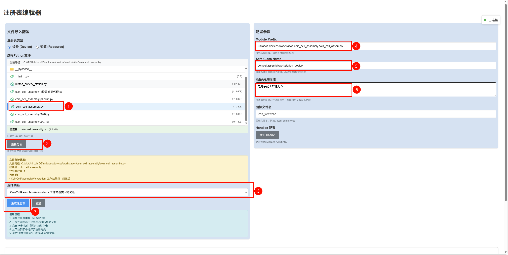
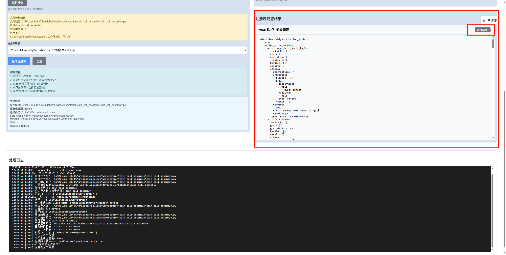

# 电池装配工站接入（PLC）

本指南将引导你完成电池装配工站（以 PLC 控制为例）的接入流程，包括新建工站文件、编写驱动与寄存器读写、生成注册表、上传及注意事项。

## 1. 新建工站文件

### 1.1 创建工站文件

在 `unilabos/devices/workstation/coin_cell_assembly` 目录下新建工站文件，如 `coin_cell_assembly.py`。工站类需继承 `WorkstationBase`，并在构造函数中初始化通信客户端与寄存器映射。

```python
from typing import Optional
# 工站基类
from unilabos.devices.workstation.workstation_base import WorkstationBase
# Modbus 通讯与寄存器 CSV 支持
from unilabos.device_comms.modbus_plc.client import TCPClient, BaseClient

class CoinCellAssemblyWorkstation(WorkstationBase):
    def __init__(
        self,
        station_resource,
        address: str = "192.168.1.20",
        port: str = "502",
        *args,
        **kwargs,
    ):
        super().__init__(station_resource=station_resource, *args, **kwargs)
        self.station_resource = station_resource  # 物料台面（Deck）
        self.success: bool = False
        self.allow_data_read: bool = False
        self.csv_export_thread = None
        self.csv_export_running = False
        self.csv_export_file: Optional[str] = None

        # 连接 PLC，并注册寄存器节点
        tcp = TCPClient(addr=address, port=port)
        tcp.client.connect()
        self.nodes = BaseClient.load_csv(".../PLC_register.csv")
        self.client = tcp.register_node_list(self.nodes)
```


## 2. 编写驱动与寄存器读写

### 2.1 寄存器示例

- `COIL_SYS_START_CMD`（BOOL，地址 8010）：启动命令（脉冲式）
- `COIL_SYS_START_STATUS`（BOOL，地址 8210）：启动状态
- `REG_DATA_OPEN_CIRCUIT_VOLTAGE`（FLOAT32，地址 10002）：开路电压
- `REG_DATA_ASSEMBLY_PRESSURE`（INT16，地址 10014）：压制扣电压力

### 2.2 最小驱动示例

```python
from unilabos.device_comms.modbus_plc.modbus import WorderOrder

def start_and_read_metrics(self):
    # 1) 下发启动（置 True 再复位 False）
    self.client.use_node('COIL_SYS_START_CMD').write(True)
    self.client.use_node('COIL_SYS_START_CMD').write(False)

    # 2) 等待进入启动状态
    while True:
        status, _ = self.client.use_node('COIL_SYS_START_STATUS').read(1)
        if bool(status[0]):
            break

    # 3) 读取关键数据（FLOAT32 需读 2 个寄存器并指定字节序）
    voltage, _ = self.client.use_node('REG_DATA_OPEN_CIRCUIT_VOLTAGE').read(
        2, word_order=WorderOrder.LITTLE
    )
    pressure, _ = self.client.use_node('REG_DATA_ASSEMBLY_PRESSURE').read(1)

    return {
        'open_circuit_voltage': voltage,
        'assembly_pressure': pressure,
    }
```

> 提示：若需参数下发，可在 PLC 端设置标志寄存器并完成握手复位，避免粘连与竞争。

## 3. 本地生成注册表并校验

完成工站类与驱动后，需要生成（或更新）工站注册表供系统识别。


### 3.1 新增工站设备（或资源）首次生成注册表
首先通过以下命令启动unilab。进入unilab系统状态检查页面

```bash
python unilabos\app\main.py -g celljson.json --ak <user的AK> --sk <user的SK>
```

点击注册表编辑，进入注册表编辑页面


按照图示步骤填写自动生成注册表信息：


步骤说明：
1. 选择新增的工站`coin_cell_assembly.py`文件
2. 点击分析按钮，分析`coin_cell_assembly.py`文件
3. 选择`coin_cell_assembly.py`文件中继承`WorkstationBase`类
4. 填写新增的工站.py文件与`unilabos`目录的距离。例如，新增的工站文件`coin_cell_assembly.py`路径为`unilabos\devices\workstation\coin_cell_assembly\coin_cell_assembly.py`，则此处填写`unilabos.devices.workstation.coin_cell_assembly`。
5. 此处填写新定义工站的类的名字（名称可以自拟）
6. 填写新的工站注册表备注信息
7. 生成注册表

以上操作步骤完成，则会生成的新的注册表ymal文件，如下图：



### 3.2 添加新生成注册表
在`unilabos\registry\devices`目录下新建一个yaml文件，此处新建文件命名为`coincellassemblyworkstation_device.yaml`，将上面生成的新的注册表信息粘贴到`coincellassemblyworkstation_device.yaml`文件中。   

在终端输入以下命令进行注册表补全操作。
```bash
python unilabos\app\register.py --complete_registry
```


### 3.3 启动并上传注册表

新增设备之后，启动unilab需要增加`--upload_registry`参数，来上传注册表信息。

```bash
python unilabos\app\main.py -g celljson.json --ak <user的AK> --sk <user的SK> --upload_registry
```

## 4. 注意事项

- 在新生成的 YAML 中，确认 `module` 指向新工站类，本例中需检查`coincellassemblyworkstation_device.yaml`文件中是否指向了`coin_cell_assembly.py`文件中定义的`CoinCellAssemblyWorkstation`类文件：

```
module: unilabos.devices.workstation.coin_cell_assembly.coin_cell_assembly:CoinCellAssemblyWorkstation
```

- 首次新增设备（或资源）需要在网页端新增注册表信息，`--complete_registry`补全注册表，`--upload_registry`上传注册表信息。

- 如果不是新增设备（或资源），仅对工站驱动的.py文件进行了修改，则不需要在网页端新增注册表信息。只需要运行补全注册表信息之后，上传注册表即可。


