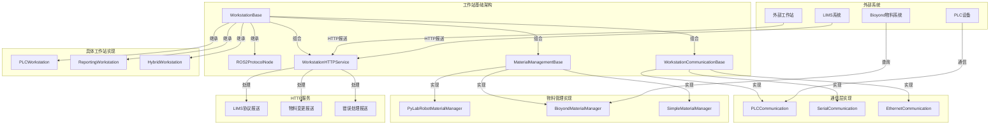
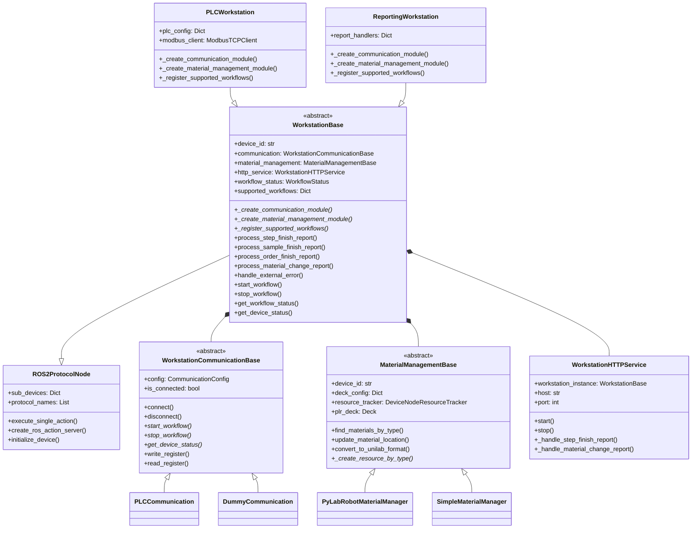
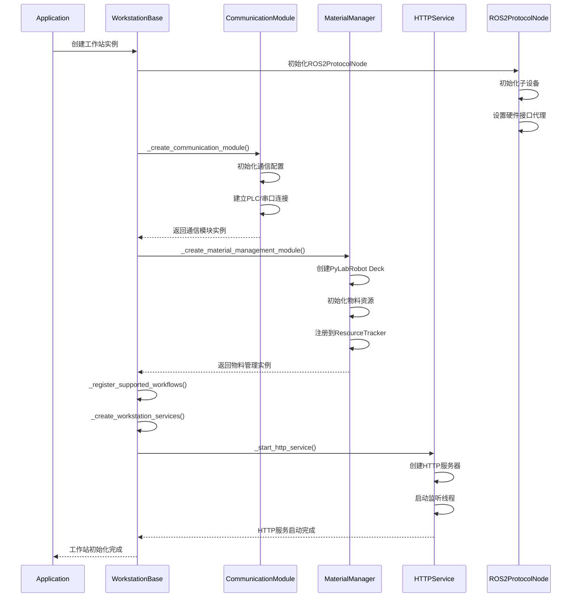
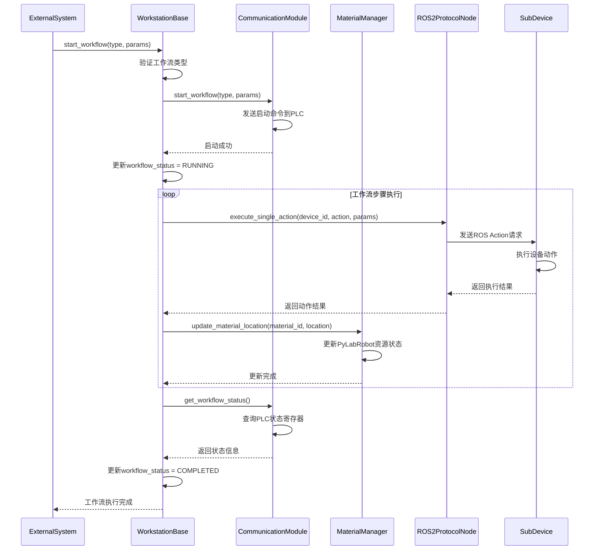
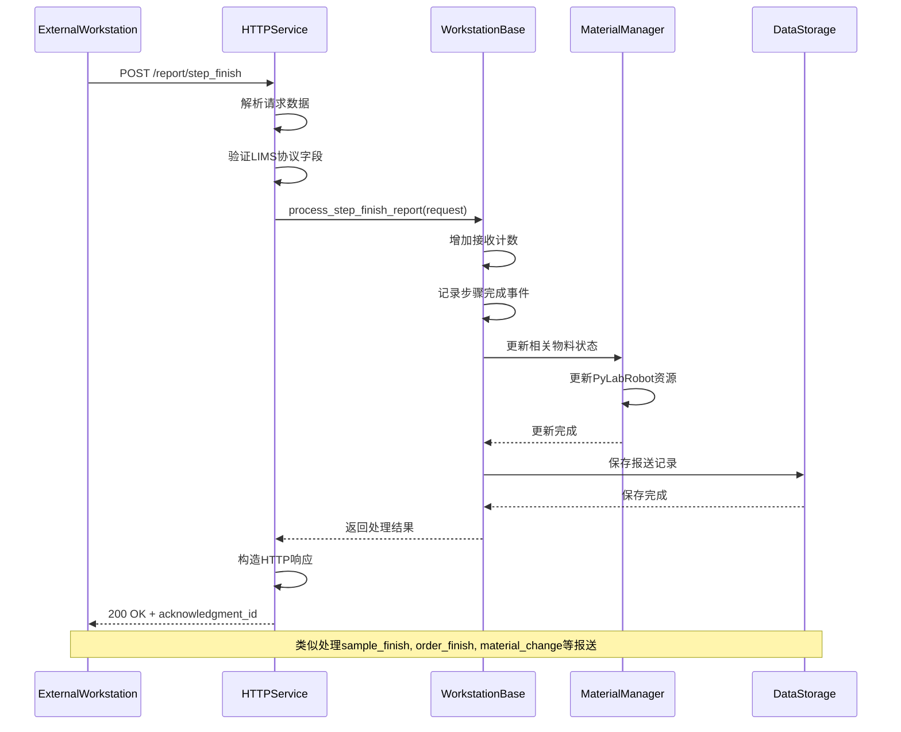
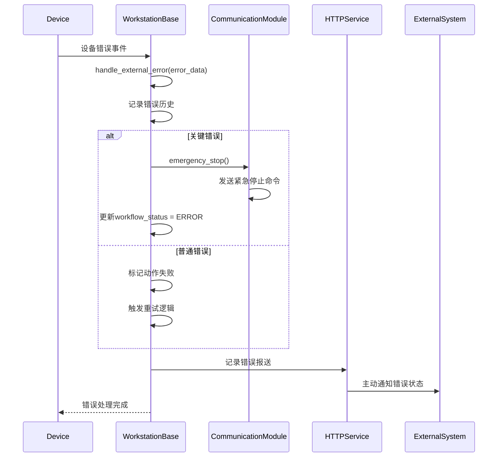

# 工作站基础架构设计文档

## 1. 整体架构图



## 2. 类关系图



## 3. 工作站启动时序图



## 4. 工作流执行时序图



## 5. HTTP报送处理时序图



## 6. 错误处理时序图



## 7. 典型工作站实现示例

### 7.1 PLC工作站实现

```python
class PLCWorkstation(WorkstationBase):
    def _create_communication_module(self):
        return PLCCommunication(self.communication_config)
    
    def _create_material_management_module(self):
        return PyLabRobotMaterialManager(
            self.device_id, 
            self.deck_config, 
            self.resource_tracker
        )
    
    def _register_supported_workflows(self):
        self.supported_workflows = {
            "battery_assembly": WorkflowInfo(...),
            "quality_check": WorkflowInfo(...)
        }
```

### 7.2 报送接收工作站实现

```python
class ReportingWorkstation(WorkstationBase):
    def _create_communication_module(self):
        return DummyCommunication(self.communication_config)
    
    def _create_material_management_module(self):
        return SimpleMaterialManager(
            self.device_id,
            self.deck_config,
            self.resource_tracker
        )
    
    def _register_supported_workflows(self):
        self.supported_workflows = {
            "data_collection": WorkflowInfo(...),
            "report_processing": WorkflowInfo(...)
        }
```

## 8. 核心接口说明

### 8.1 必须实现的抽象方法
- `_create_communication_module()`: 创建通信模块
- `_create_material_management_module()`: 创建物料管理模块
- `_register_supported_workflows()`: 注册支持的工作流

### 8.2 可重写的报送处理方法
- `process_step_finish_report()`: 步骤完成处理
- `process_sample_finish_report()`: 样本完成处理
- `process_order_finish_report()`: 订单完成处理
- `process_material_change_report()`: 物料变更处理
- `handle_external_error()`: 错误处理

### 8.3 工作流控制接口
- `start_workflow()`: 启动工作流
- `stop_workflow()`: 停止工作流
- `get_workflow_status()`: 获取状态

## 9. 配置参数说明

```python
workstation_config = {
    "communication_config": {
        "protocol": "modbus_tcp",
        "host": "192.168.1.100",
        "port": 502
    },
    "deck_config": {
        "size_x": 1000.0,
        "size_y": 1000.0,
        "size_z": 500.0
    },
    "http_service_config": {
        "enabled": True,
        "host": "127.0.0.1",
        "port": 8081
    },
    "communication_interfaces": {
        "logical_device_1": CommunicationInterface(...)
    }
}
```

这个架构设计支持：
1. **灵活的通信方式**: 通过CommunicationBase支持PLC、串口、以太网等
2. **多样的物料管理**: 支持PyLabRobot、Bioyond、简单物料系统
3. **统一的HTTP报送**: 基于LIMS协议的标准化报送接口
4. **完整的工作流控制**: 支持动态和静态工作流
5. **强大的错误处理**: 多层次的错误处理和恢复机制
