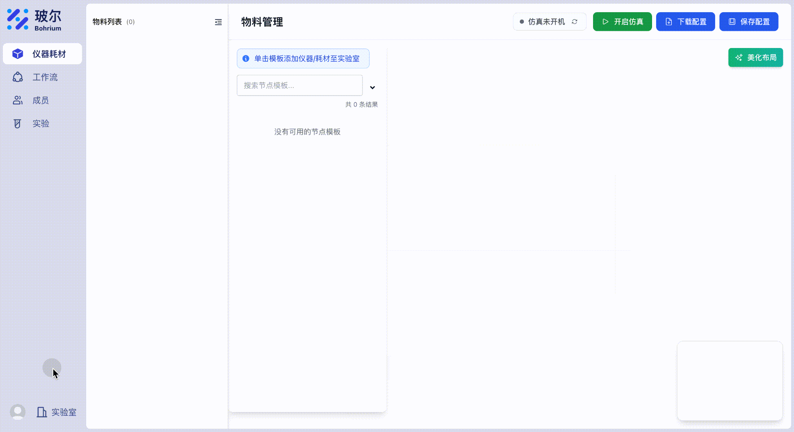

# Uni-Lab 配置指南

Uni-Lab 支持通过 Python 配置文件进行灵活的系统配置。本指南将帮助您理解配置选项并设置您的 Uni-Lab 环境。

## 配置文件格式

Uni-Lab 支持 Python 格式的配置文件，它比 YAML 或 JSON 提供更多的灵活性，包括支持注释、条件逻辑和复杂数据结构。

### 默认配置示例

首次使用时，系统会自动创建一个基础配置文件 `local_config.py`：

```python
# unilabos的配置文件

class BasicConfig:
    ak = ""  # 实验室网页给您提供的ak代码，您可以在配置文件中指定，也可以通过运行unilabos时以 --ak 传入，优先按照传入参数解析
    sk = ""  # 实验室网页给您提供的sk代码，您可以在配置文件中指定，也可以通过运行unilabos时以 --sk 传入，优先按照传入参数解析


# WebSocket配置，一般无需调整
class WSConfig:
    reconnect_interval = 5  # 重连间隔（秒）
    max_reconnect_attempts = 999  # 最大重连次数
    ping_interval = 30  # ping间隔（秒）
```
您可以进入实验室，点击左下角的头像在实验室详情中获取所在实验室的ak sk


### 完整配置示例

您可以根据需要添加更多配置选项：

```python
#!/usr/bin/env python
# coding=utf-8
"""Uni-Lab 配置文件"""

# 基础配置
class BasicConfig:
    ak = "your_access_key"  # 实验室访问密钥
    sk = "your_secret_key"  # 实验室私钥
    working_dir = ""  # 工作目录（通常自动设置）
    config_path = ""  # 配置文件路径（自动设置）
    is_host_mode = True  # 是否为主站模式
    slave_no_host = False  # 从站模式下是否跳过等待主机服务
    upload_registry = False  # 是否上传注册表
    machine_name = "undefined"  # 机器名称（自动获取）
    vis_2d_enable = False  # 是否启用2D可视化
    enable_resource_load = True  # 是否启用资源加载
    communication_protocol = "websocket"  # 通信协议

# WebSocket配置
class WSConfig:
    reconnect_interval = 5  # 重连间隔（秒）
    max_reconnect_attempts = 999  # 最大重连次数
    ping_interval = 30  # ping间隔（秒）

# OSS上传配置
class OSSUploadConfig:
    api_host = ""  # API主机地址
    authorization = ""  # 授权信息
    init_endpoint = ""  # 初始化端点
    complete_endpoint = ""  # 完成端点
    max_retries = 3  # 最大重试次数

# HTTP配置
class HTTPConfig:
    remote_addr = "http://127.0.0.1:48197/api/v1"  # 远程地址

# ROS配置
class ROSConfig:
    modules = [
        "std_msgs.msg",
        "geometry_msgs.msg",
        "control_msgs.msg",
        "control_msgs.action",
        "nav2_msgs.action",
        "unilabos_msgs.msg",
        "unilabos_msgs.action",
    ]  # 需要加载的ROS模块
```

## 命令行参数覆盖配置

Uni-Lab 允许通过命令行参数覆盖配置文件中的设置，提供更灵活的配置方式。命令行参数的优先级高于配置文件。

### 支持命令行覆盖的配置项

以下配置项可以通过命令行参数进行覆盖：

| 配置类        | 配置字段          | 命令行参数          | 说明                             |
| ------------- | ----------------- | ------------------- | -------------------------------- |
| `BasicConfig` | `ak`              | `--ak`              | 实验室访问密钥                   |
| `BasicConfig` | `sk`              | `--sk`              | 实验室私钥                       |
| `BasicConfig` | `working_dir`     | `--working_dir`     | 工作目录路径                     |
| `BasicConfig` | `is_host_mode`    | `--is_slave`        | 主站模式（参数为从站模式，取反） |
| `BasicConfig` | `slave_no_host`   | `--slave_no_host`   | 从站模式下跳过等待主机服务       |
| `BasicConfig` | `upload_registry` | `--upload_registry` | 启动时上传注册表信息             |
| `BasicConfig` | `vis_2d_enable`   | `--2d_vis`          | 启用 2D 可视化                   |
| `HTTPConfig`  | `remote_addr`     | `--addr`            | 远程服务地址                     |

### 特殊命令行参数

除了直接覆盖配置项的参数外，还有一些特殊的命令行参数：

| 参数                | 说明                                 |
| ------------------- | ------------------------------------ |
| `--config`          | 指定配置文件路径                     |
| `--port`            | Web 服务端口（不影响配置文件）       |
| `--disable_browser` | 禁用自动打开浏览器（不影响配置文件） |
| `--visual`          | 可视化工具选择（不影响配置文件）     |
| `--skip_env_check`  | 跳过环境检查（不影响配置文件）       |

### 配置优先级

配置项的生效优先级从高到低为：

1. **命令行参数**：最高优先级
2. **环境变量**：中等优先级
3. **配置文件**：基础优先级

### 使用示例

```bash
# 通过命令行覆盖认证信息
unilab --ak "new_access_key" --sk "new_secret_key"

# 覆盖服务器地址
unilab --addr "https://custom.server.com/api/v1"

# 启用从站模式并跳过等待主机
unilab --is_slave --slave_no_host

# 启用上传注册表和2D可视化
unilab --upload_registry --2d_vis

# 组合使用多个覆盖参数
unilab --ak "key" --sk "secret" --addr "test" --upload_registry --2d_vis
```

### 预设环境地址

`--addr` 参数支持以下预设值，会自动转换为对应的完整 URL：

- `test` → `https://uni-lab.test.bohrium.com/api/v1`
- `uat` → `https://uni-lab.uat.bohrium.com/api/v1`
- `local` → `http://127.0.0.1:48197/api/v1`
- 其他值 → 直接使用作为完整 URL

## 配置选项详解

### 基础配置 (BasicConfig)

基础配置包含了系统运行的核心参数：

| 参数                     | 类型 | 默认值        | 说明                                       |
| ------------------------ | ---- | ------------- | ------------------------------------------ |
| `ak`                     | str  | `""`          | 实验室访问密钥（必需）                     |
| `sk`                     | str  | `""`          | 实验室私钥（必需）                         |
| `working_dir`            | str  | `""`          | 工作目录，通常自动设置                     |
| `is_host_mode`           | bool | `True`        | 是否为主站模式                             |
| `slave_no_host`          | bool | `False`       | 从站模式下是否跳过等待主机服务             |
| `upload_registry`        | bool | `False`       | 启动时是否上传注册表信息                   |
| `machine_name`           | str  | `"undefined"` | 机器名称，自动从 hostname 获取（不可配置） |
| `vis_2d_enable`          | bool | `False`       | 是否启用 2D 可视化                         |
| `communication_protocol` | str  | `"websocket"` | 通信协议，固定为 websocket                 |

#### 认证配置

`ak` 和 `sk` 是必需的认证参数：

1. **获取方式**：在 [Uni-Lab 官网](https://uni-lab.bohrium.com) 注册实验室后获得
2. **配置方式**：
   - **命令行参数**：`--ak "your_key" --sk "your_secret"`（最高优先级）
   - **配置文件**：在 `BasicConfig` 类中设置
   - **环境变量**：`UNILABOS_BASICCONFIG_AK` 和 `UNILABOS_BASICCONFIG_SK`
3. **优先级顺序**：命令行参数 > 环境变量 > 配置文件
4. **安全注意**：请妥善保管您的密钥信息

**推荐做法**：

- 开发环境：使用配置文件
- 生产环境：使用环境变量或命令行参数
- 临时测试：使用命令行参数

### WebSocket 配置 (WSConfig)

WebSocket 是 Uni-Lab 的主要通信方式：

| 参数                     | 类型 | 默认值 | 说明               |
| ------------------------ | ---- | ------ | ------------------ |
| `reconnect_interval`     | int  | `5`    | 断线重连间隔（秒） |
| `max_reconnect_attempts` | int  | `999`  | 最大重连次数       |
| `ping_interval`          | int  | `30`   | 心跳检测间隔（秒） |

### HTTP 配置 (HTTPConfig)

HTTP 客户端配置用于与云端服务通信：

| 参数          | 类型 | 默认值                            | 说明         |
| ------------- | ---- | --------------------------------- | ------------ |
| `remote_addr` | str  | `"http://127.0.0.1:48197/api/v1"` | 远程服务地址 |

**预设环境地址**：

- 生产环境：`https://uni-lab.bohrium.com/api/v1`
- 测试环境：`https://uni-lab.test.bohrium.com/api/v1`
- UAT 环境：`https://uni-lab.uat.bohrium.com/api/v1`
- 本地环境：`http://127.0.0.1:48197/api/v1`

### ROS 配置 (ROSConfig)

配置 ROS 消息转换器需要加载的模块：

```python
class ROSConfig:
    modules = [
        "std_msgs.msg",           # 标准消息类型
        "geometry_msgs.msg",      # 几何消息类型
        "control_msgs.msg",       # 控制消息类型
        "control_msgs.action",    # 控制动作类型
        "nav2_msgs.action",       # 导航动作类型
        "unilabos_msgs.msg",      # UniLab 自定义消息类型
        "unilabos_msgs.action",   # UniLab 自定义动作类型
    ]
```

您可以根据实际使用的设备和功能添加其他 ROS 模块。

### OSS 上传配置 (OSSUploadConfig)

对象存储服务配置，用于文件上传功能：

| 参数                | 类型 | 默认值 | 说明                 |
| ------------------- | ---- | ------ | -------------------- |
| `api_host`          | str  | `""`   | OSS API 主机地址     |
| `authorization`     | str  | `""`   | 授权认证信息         |
| `init_endpoint`     | str  | `""`   | 上传初始化端点       |
| `complete_endpoint` | str  | `""`   | 上传完成端点         |
| `max_retries`       | int  | `3`    | 上传失败最大重试次数 |

## 环境变量支持

Uni-Lab 支持通过环境变量覆盖配置文件中的设置。环境变量格式为：

```
UNILABOS_{配置类名}_{字段名}
```

### 环境变量示例

```bash
# 设置基础配置
export UNILABOS_BASICCONFIG_AK="your_access_key"
export UNILABOS_BASICCONFIG_SK="your_secret_key"
export UNILABOS_BASICCONFIG_IS_HOST_MODE="true"

# 设置WebSocket配置
export UNILABOS_WSCONFIG_RECONNECT_INTERVAL="10"
export UNILABOS_WSCONFIG_MAX_RECONNECT_ATTEMPTS="500"

# 设置HTTP配置
export UNILABOS_HTTPCONFIG_REMOTE_ADDR="https://uni-lab.bohrium.com/api/v1"
```

### 环境变量类型转换

- **布尔值**：`"true"`, `"1"`, `"yes"` → `True`；其他 → `False`
- **整数**：自动转换为 `int` 类型
- **浮点数**：自动转换为 `float` 类型
- **字符串**：保持原值

## 配置文件使用方法

### 1. 指定配置文件启动

```bash
# 使用指定配置文件启动
unilab --config /path/to/your/config.py
```

### 2. 使用默认配置文件

如果不指定配置文件，系统会按以下顺序查找：

1. 环境变量 `UNILABOS_BASICCONFIG_CONFIG_PATH` 指定的路径
2. 工作目录下的 `local_config.py`
3. 首次使用时会引导创建配置文件

### 3. 配置文件验证

系统启动时会自动验证配置文件：

- **语法检查**：确保 Python 语法正确
- **类型检查**：验证配置项类型是否匹配
- **必需项检查**：确保 `ak` 和 `sk` 已配置

## 最佳实践

### 1. 安全配置

- 不要将包含密钥的配置文件提交到版本控制系统
- 使用环境变量或命令行参数在生产环境中配置敏感信息
- 定期更换访问密钥
- **推荐配置方式**：

  ```bash
  # 生产环境 - 使用环境变量
  export UNILABOS_BASICCONFIG_AK="your_access_key"
  export UNILABOS_BASICCONFIG_SK="your_secret_key"
  unilab

  # 或使用命令行参数
  unilab --ak "your_access_key" --sk "your_secret_key"
  ```

### 2. 多环境配置

为不同环境创建不同的配置文件并结合命令行参数：

```
configs/
├── local_config.py      # 本地开发
├── test_config.py       # 测试环境
├── prod_config.py       # 生产环境
└── example_config.py    # 示例配置
```

**环境切换示例**：

```bash
# 本地开发环境
unilab --config configs/local_config.py --addr local

# 测试环境
unilab --config configs/test_config.py --addr test --upload_registry

# 生产环境
unilab --config configs/prod_config.py --ak "$PROD_AK" --sk "$PROD_SK"
```

### 3. 配置管理

- 保持配置文件简洁，只包含需要修改的配置项
- 为配置项添加注释说明其作用
- 定期检查和更新配置文件
- **命令行参数优先使用场景**：
  - 临时测试不同配置
  - CI/CD 流水线中的动态配置
  - 不同环境间快速切换
  - 敏感信息的安全传递

### 4. 灵活配置策略

**基础配置文件 + 命令行覆盖**的推荐方式：

```python
# base_config.py - 基础配置
class BasicConfig:
    # 非敏感配置写在文件中
    is_host_mode = True
    upload_registry = False
    vis_2d_enable = False

class WSConfig:
    reconnect_interval = 5
    max_reconnect_attempts = 999
    ping_interval = 30
```

```bash
# 启动时通过命令行覆盖关键参数
unilab --config base_config.py \
       --ak "$AK" \
       --sk "$SK" \
       --addr "test" \
       --upload_registry \
       --2d_vis
```

## 故障排除

### 1. 配置文件加载失败

**错误信息**：`[ENV] 配置文件 xxx 不存在`

**解决方法**：

- 确认配置文件路径正确
- 检查文件权限是否可读
- 确保配置文件是 `.py` 格式

### 2. 语法错误

**错误信息**：`[ENV] 加载配置文件 xxx 失败`

**解决方法**：

- 检查 Python 语法是否正确
- 确认类名和字段名拼写正确
- 验证缩进是否正确（使用空格而非制表符）

### 3. 认证失败

**错误信息**：`后续运行必须拥有一个实验室`

**解决方法**：

- 确认 `ak` 和 `sk` 已正确配置
- 检查密钥是否有效
- 确认网络连接正常

### 4. 环境变量不生效

**解决方法**：

- 确认环境变量名格式正确（`UNILABOS_CLASS_FIELD`）
- 检查环境变量是否已正确设置
- 重启系统或重新加载环境变量

### 5. 命令行参数不生效

**错误现象**：设置了命令行参数但配置没有生效

**解决方法**：

- 确认参数名拼写正确（如 `--ak` 而不是 `--access_key`）
- 检查参数格式是否正确（布尔参数如 `--is_slave` 不需要值）
- 确认参数位置正确（所有参数都应在 `unilab` 之后）
- 查看启动日志确认参数是否被正确解析

### 6. 配置优先级混淆

**错误现象**：不确定哪个配置生效

**解决方法**：

- 记住优先级：命令行参数 > 环境变量 > 配置文件
- 使用 `--ak` 和 `--sk` 参数时会看到提示信息
- 检查启动日志中的配置加载信息
- 临时移除低优先级配置来测试高优先级配置是否生效
